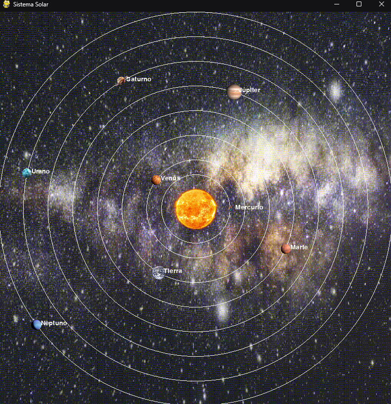

# 🌌 Simulador del Sistema Solar con Pygame

 <!-- Puedes agregar tu propia captura -->

Un simulador interactivo del sistema solar con fondo animado y funcionalidades de visualización ajustables.

## 🚀 Características Principales
- Fondo animado con soporte para GIF
- Movimiento orbital realista de los planetas
- Modo pantalla completa (F11)
- Escalado adaptable a diferentes resoluciones
- Notificación de pantalla completa en ventanas pequeñas
- Nombres de planetas superpuestos
- Órbitas visibles

## 📋 Requisitos
- Python 3.8+
- Pygame 2.0+
- Pillow 9.0+

## 🔧 Instalación
1. Clona el repositorio:
```bash
git clone https://github.com/Meliodas-96/sistema-solar.git

cd sistema-solar

pip install -r requirements.txt

python "System Solar Simulator".py
```

# Controles:

- F11: Alternar pantalla completa

- Esc: Salir del programa (en modo pantalla completa)

- Click en la 'X' de la ventana para salir

## 🛠 Personalización
Puedes modificar los parámetros de los planetas en el array planets:
```bash
planets = [
    CelestialBody(
        "Earth.png",    # Archivo de imagen
        14,             # Radio del planeta
        150,            # Distancia orbital
        1,              # Velocidad orbital
        name="Tierra"   # Nombre a mostrar
    ),
    # ... otros planetas
]
```

## 📝 Notas
- Asegúrate de tener todas las imágenes planetarias en la carpeta Imagenes

- El archivo GIF de fondo debe llamarse background.gif

- Ajusta frame_delay para cambiar la velocidad de la animación del fondo
